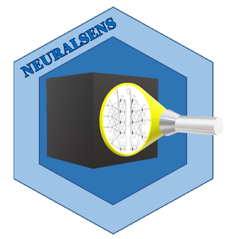

# NeuralSens  

#### *Jaime Pizarroso Gonzalo, jpizarroso@comillas.edu*
#### *Antonio Muñoz San Roque, Antonio.Munoz@iit.comillas.edu*
#### *José Portela González, jose.portela@iit.comillas.edu*

<!-- badges: start -->

- R : [](https://CRAN.R-project.org/package=NeuralSens)
[](https://cranlogs.r-pkg.org/badges/grand-total/NeuralSens)
- Python : [](https://pypi.python.org/pypi/neuralsens)
[](https://pepy.tech/project/neuralsens)
[]()
[]()
<!-- badges: end -->

This is the development repository for the `neuralsens`  package and the `NeuralSens`  package.  Functions within this package can be used for the analysis of neural network models created in R. 

### How to install

For Python, the last version of the `neuralsens` package can be installed using pip or conda:

```bash
$ pip install neuralsens
$ conda install -c jaipizgon neuralsens
```

For R, the last version of the `NeuralSens` package can be installed from Github or CRAN:
```r
# Github 
install.packages('devtools')
library(devtools)
install_github('JaiPizGon/NeuralSens/R')
# CRAN
install.packages('NeuralSens')
```

### Citation

Please, to cite NeuralSens in publications use:

Pizarroso J, Portela J, Muñoz A (2022). “NeuralSens: Sensitivity Analysis of Neural Networks.” _Journal of
Statistical Software_, *102*(7), 1-36. doi: 10.18637/jss.v102.i07 (URL:
https://doi.org/10.18637/jss.v102.i07).

### License

This package is released in the public domain under the General Public License [GPL](https://www.gnu.org/licenses/gpl-3.0.en.html). 

### Association
Package created in the Institute for Research in Technology (IIT), [link to homepage](https://www.iit.comillas.edu/index.php.en) 
