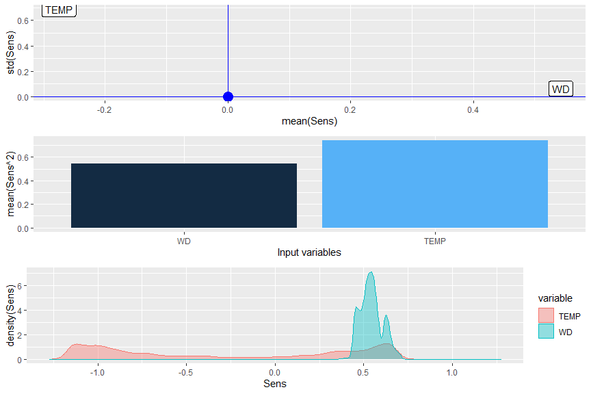

# NeuralSens 

#### *Jaime Pizarroso Gonzalo, jpizarroso@comillas.edu*
#### *Antonio Muñoz San Roque, Antonio.Munoz@iit.comillas.edu*
#### *José Portela González, jose.portela@iit.comillas.edu*
<!-- badges: start -->
[](https://travis-ci.org/JaiPizGon/NeuralSens)
[](https://ci.appveyor.com/project/JaiPizGon/NeuralSens)
[](https://cranlogs.r-pkg.org/badges/grand-total/NeuralSens)
<!-- badges: end -->


This is the development repository for the NeuralSens package.  Functions within this package can be used for the analysis of neural network models created in R. 

The current version of this package can be installed from Github:


```r
install.packages('devtools')
library(devtools)
install_github('JaiPizGon/NeuralSens')
```

The last version can be installed from CRAN:


```r
install.packages('NeuralSens')
```

### Bug reports

Please submit any bug reports (or suggestions) using the [issues](https://github.com/JaiPizGon/NeuralSens/issues) tab of the GitHub page.

### Functions


One function is available to analyze the sensitivity of a multilayer perceptron, 
evaluating variable importance and plotting the analysis results. A sample dataset is also provided for use with the examples. The function has S3 methods developed for neural networks from the following packages: [nnet](https://cran.r-project.org/package=nnet), [neuralnet](https://cran.r-project.org/package=neuralnet), [RSNNS](https://cran.r-project.org/package=RSNNS), [caret](https://cran.r-project.org/package=caret),
[neural](https://cran.r-project.org/package=neural),
[h2o](https://cran.r-project.org/package=h2o) and [forecast](https://cran.r-project.org/package=forecast).  Numeric inputs that describe model weights are also acceptable. 
 
Start by loading the package and the sample dataset.


```r
library(NeuralSens)
data(DAILY_DEMAND_TR)
```

The `SensAnalysisMLP` function analyze the sensitivity of the output to the input and  plots three graphics with information about this analysis. To calculate this sensitivity it calculates the partial derivatives of the output to the inputs using the training data. 
The first plot shows information between the mean and the standard deviation of the sensitivity among the training data:
- if the mean is different from zero, it means that the output depends on the input because the output changes when the input change.
- if the mean is nearly zero, it means that the output could not depend on the input. If the standard deviation is also near zero it almost sure that the output does not depend on the variable because for all the training data the partial derivative is zero.
- if the standard deviation is different from zero it means the the output has a non-linear relation with the input because the partial derivative derivative of the output depends on the value of the input.
- if the standard deviation is nearly zero it means that the output has a linear relation with the input because the partial derivative of the output does not depend on the value of the input.
The second plot gives an absolute measure to the importance of the inputs, by calculating the sum of the squares of the partial derivatives of the output to the inputs.
The third plot is a density plot of the partial derivatives of the output to the inputs among the training data, giving similar information as the first plot.


```r
# Scale the data
DAILY_DEMAND_TR[,4] <- DAILY_DEMAND_TR[,4]/10
DAILY_DEMAND_TR[,2] <- DAILY_DEMAND_TR[,2]/100
# Parameters of the neural network
hidden_neurons <- 5
iters <- 250
decay <- 0.1

# create neural network
library(caret)
ctrl_tune <- trainControl(method = "boot",
                          savePredictions = FALSE,
                          summaryFunction = defaultSummary)
set.seed(150) #For replication
mod <- caret::train(form = DEM~TEMP + WD,
                    data = DAILY_DEMAND_TR,
                    method = "nnet",
                    linout = TRUE,
                    tuneGrid = data.frame(size = hidden_neurons,
                                          decay = decay),
                    maxit = iters,
                    preProcess = c("center","scale"),
                    trControl = ctrl_tune,
                    metric = "RMSE")

# Analysis of the neural network
sens <- SensAnalysisMLP(mod)
```

<!-- -->
Apart from the plot created with the `SensAnalysisMLP` function by an internal call
to `SensitivityPlot`, other plots can be obtained to analyze the neural network model.
If it is a forecast problem, the `SensTimePlot` function returns a plot which shows
how the sensitivity of the output changes over the time of the data. 


```r
SensTimePlot(sens, fdata = DAILY_DEMAND_TR, facet = TRUE)
```

<!-- -->

Also, a more detailed plot about the distribution of the variables can be obtained with
the `SensFeaturePlot` function. This function returns a scatter plot over a violin plot 
for each input variable, where each point represent a sensitivity value of a sample of the
dataset. The color of each point depends on the value of the input for its corresponding sample.


```r
SensFeaturePlot(sens, fdata = DAILY_DEMAND_TR)
```

<!-- -->

### License

This package is released in the public domain under the General Public License [GPL](https://www.gnu.org/licenses/gpl-3.0.en.html). 

### Association
Package created in the Institute for Research in Technology (IIT), [link to homepage](https://www.iit.comillas.edu/index.php.en) 
