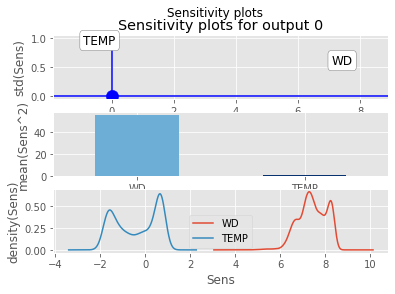

# NeuralSens 

#### *Jaime Pizarroso Gonzalo, jpizarroso@comillas.edu*
#### *Antonio Muñoz San Roque, Antonio.Munoz@iit.comillas.edu*
#### *José Portela González, jose.portela@iit.comillas.edu*
<!-- badges: start -->

[](https://neuralsens.readthedocs.io/en/latest/?version=latest)
[](https://pypi.python.org/pypi/neuralsens)
[]()
[]()
<!-- badges: end -->
This is the development repository for the `neuralsens` package.  Functions within this package can be used for the analysis of neural network models created in Python. 

The last version of this package can be installed using pip:

```bash
$ pip install neuralsens
```

### Bug reports

Please submit any bug reports (or suggestions) using the [issues](https://github.com/JaiPizGon/NeuralSens/issues) tab of the GitHub page.

### Functions

One function is available to analyze the sensitivity of a multilayer perceptron, evaluating variable importance and plotting the analysis results.

```python
# Import necessary packages to reproduce the example
import neuralsens.partial_derivatives as ns
import pandas as pd
from sklearn.neural_network import MLPRegressor

# Load data and scale variables
daily_demand_tr = pd.read_csv("../../data/DAILY_DEMAND_TR.csv", sep=";", index_col="DATE")
X_train = daily_demand_tr[["WD","TEMP"]]
X_train.iloc[:, 1] = X_train.iloc[:, 1] / 10
y_train = daily_demand_tr["DEM"] / 100
```

The `jacobian_mlp` function analyze the sensitivity of the output to the input and  plots three graphics with information about this analysis. To calculate this sensitivity it calculates the partial derivatives of the output to the inputs using the training data. 
The first plot shows information between the mean and the standard deviation of the sensitivity among the training data:
- if the mean is different from zero, it means that the output depends on the input because the output changes when the input change.
- if the mean is nearly zero, it means that the output could not depend on the input. If the standard deviation is also near zero it almost sure that the output does not depend on the variable because for all the training data the partial derivative is zero.
- if the standard deviation is different from zero it means the the output has a non-linear relation with the input because the partial derivative derivative of the output depends on the value of the input.
- if the standard deviation is nearly zero it means that the output has a linear relation with the input because the partial derivative of the output does not depend on the value of the input.
The second plot gives an absolute measure to the importance of the inputs, by calculating the sum of the squares of the partial derivatives of the output to the inputs.
The third plot is a density plot of the partial derivatives of the output to the inputs among the training data, giving similar information as the first plot.

```python
### Create MLP model
model = MLPRegressor(solver='sgd', # Update function
                    hidden_layer_sizes=[40], # #neurons in hidden layers
                    learning_rate_init=0.1, # initial learning rate
                    activation='logistic', # Logistic sigmoid activation function
                    alpha=0.005, # L2 regularization term
                    learning_rate='adaptive', # Type of learning rate used in training
                    max_iter=500, # Maximum number of iterations
                    batch_size=10, # Size of batch when training
                    random_state=150)

# Train model
model.fit(X_train, y_train)

# Obtain parameters to perform jacobian
wts = model.coefs_
bias = model.intercepts_
actfunc = ['identity',model.get_params()['activation'],model.out_activation_]
X = pd.DataFrame(X_train, columns=["WD","TEMP"])
y = pd.DataFrame(y_train, columns=["DEM"])
sens_end_layer = 'last'
sens_end_input = False
sens_origin_layer = 0
sens_origin_input = True

# Perform jacobian of the model
jacobian = ns.jacobian_mlp(wts, bias, actfunc, X, y)
jacobian.plot("sens")
```

<!-- -->
Apart from the plot created with the `"sens"` argument by an internal call
to `sensitivity_plots()`, other plots can be obtained to analyze the neural 
network model (although they are yet to be coded, thanks for your patience!).

### Citation

Please, to cite NeuralSens in publications use:

Pizarroso J, Portela J, Muñoz A (2022). “NeuralSens: Sensitivity Analysis of Neural Networks.” _Journal of
Statistical Software_, *102*(7), 1-36. doi: 10.18637/jss.v102.i07 (URL:
https://doi.org/10.18637/jss.v102.i07).

### License

This package is released in the public domain under the General Public License [GPL](https://www.gnu.org/licenses/gpl-3.0.en.html). 

### Association
Package created in the Institute for Research in Technology (IIT), [link to homepage](https://www.iit.comillas.edu/index.php.en) 
