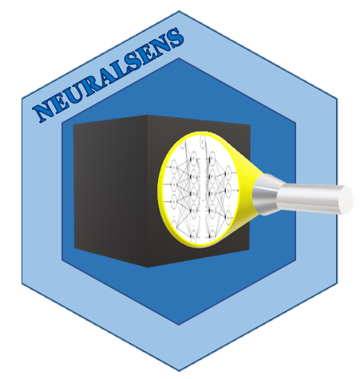

# NeuralSens 

#### *Jaime Pizarroso Gonzalo, jpizarroso@comillas.edu*
#### *Antonio Muñoz San Roque, Antonio.Munoz@iit.comillas.edu*
#### *José Portela González, jose.portela@iit.comillas.edu*
<!-- badges: start -->

[](https://neuralsens.readthedocs.io/en/latest/?version=latest)
[](https://pypi.python.org/pypi/neuralsens)
[]()
[]()
<!-- badges: end -->
This is the development repository for the neuralsens package.  Functions within this package can be used for the analysis of neural network models created in Python. 

The last version of this package can be installed using pip:

```bash
$ pip install neuralsens
```

### Bug reports

Please submit any bug reports (or suggestions) using the [issues](https://github.com/JaiPizGon/NeuralSens/issues) tab of the GitHub page.

### Functions

TO DO

### Citation

Please, to cite NeuralSens in publications use:

Pizarroso J, Portela J, Muñoz A (2022). “NeuralSens: Sensitivity Analysis of Neural Networks.” _Journal of
Statistical Software_, *102*(7), 1-36. doi: 10.18637/jss.v102.i07 (URL:
https://doi.org/10.18637/jss.v102.i07).

### License

This package is released in the public domain under the General Public License [GPL](https://www.gnu.org/licenses/gpl-3.0.en.html). 

### Association
Package created in the Institute for Research in Technology (IIT), [link to homepage](https://www.iit.comillas.edu/index.php.en) 
